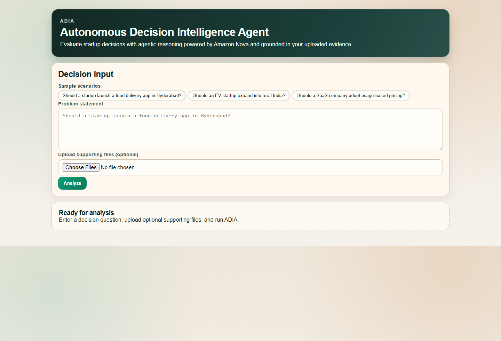
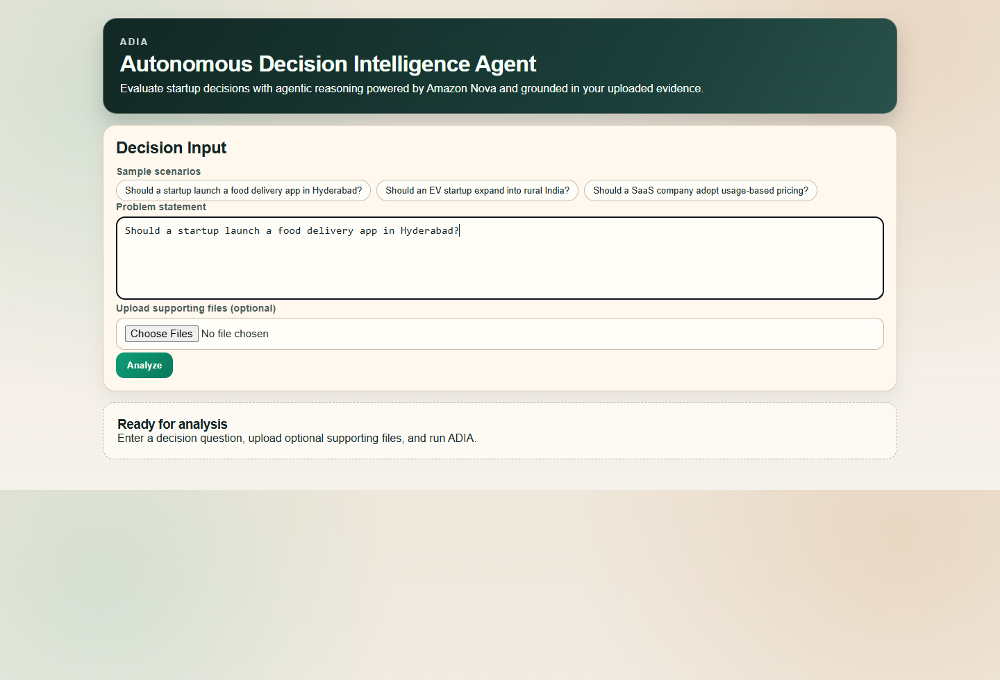
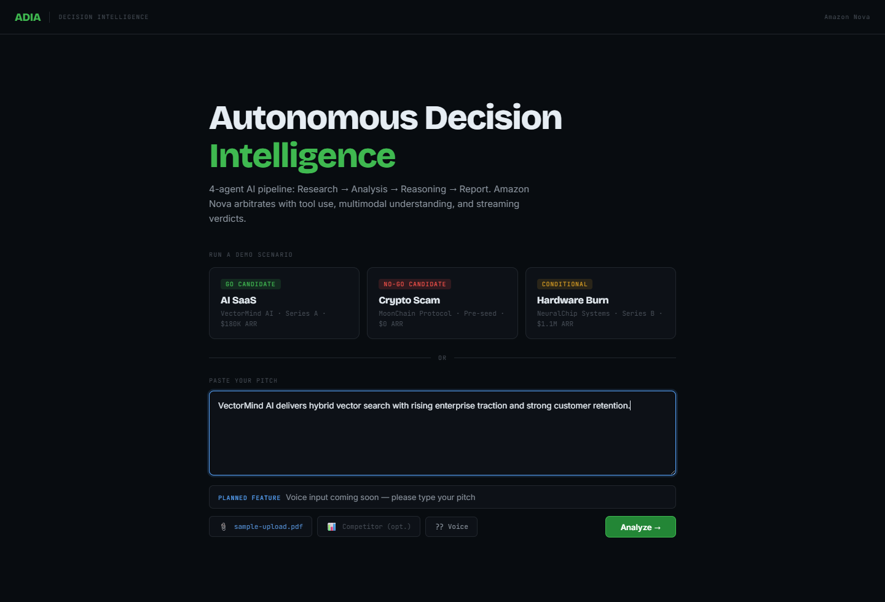
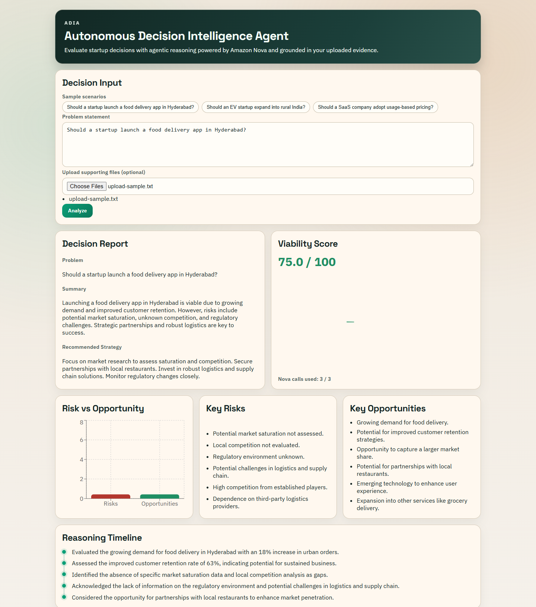
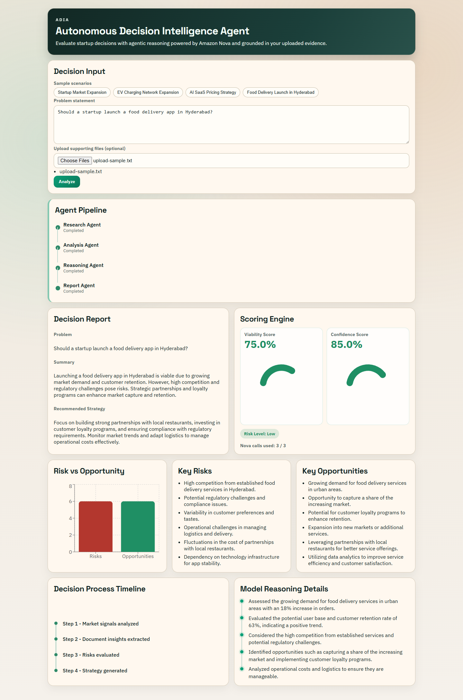
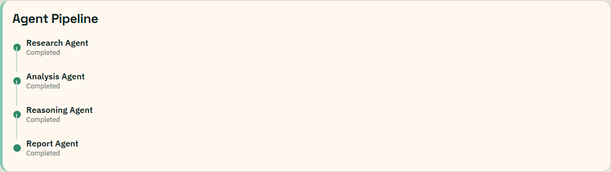
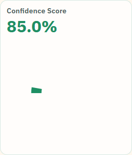

# ADIA — Autonomous Decision Intelligence Agent

## Overview
ADIA is an AI-powered decision intelligence system built for the Amazon Nova Hackathon. It helps teams evaluate strategic business questions using an agent-based reasoning workflow and optional uploaded evidence. The full application runs locally with FastAPI and Next.js, while model inference is handled through Amazon Nova on AWS Bedrock.

## Architecture
```text
User Input
   |
   v
Research Agent
   |
   v
Analysis Agent
   |
   v
Reasoning Agent
   |
   v
Report Agent
   |
   v
Decision Dashboard
```

```text
Problem + Optional Files
        |
        v
FastAPI (/analyze, /analyze-with-docs)
        |
        v
ADIAOrchestrator
  |- ResearchAgent      -> Nova call #1
  |- DocumentParser     -> PyPDF2 + local FAISS retrieval
  |- AnalysisAgent      -> Nova call #2 (text + image context)
  |- ReasoningAgent     -> Nova call #3
  `- ReportAgent        -> final structured response
```

## Features
- Multi-agent workflow for structured decision-making.
- Problem-only and problem-with-documents analysis modes.
- Optional reasoning chain output via `reasoning_steps`.
- Dashboard visualization for viability score, risks, opportunities, and strategy.
- Demo-ready sample scenario buttons for fast judging flow.
- Strict cost control with maximum 3 Nova calls per request.

## What Makes ADIA Unique
- Agent-based reasoning architecture
- Multimodal document analysis
- Structured decision intelligence output
- Confidence scoring system

## Technology Stack
- Backend: FastAPI, Python, boto3, python-dotenv.
- Frontend: Next.js (Pages Router), React, Recharts.
- Retrieval: FAISS (local vector similarity).
- File Processing: PyPDF2.

## Amazon Nova Integration
- Model used: `amazon.nova-lite-v1:0`.
- Bedrock runtime is accessed through a reusable Nova client (`ask_nova`).
- Nova is invoked for: Research Agent, Analysis Agent, and Reasoning Agent.
- Call budget is enforced per request: **max 3 Nova calls**.
- Everything else (routing, orchestration, retrieval, UI) runs locally.

## Setup Instructions
### Backend
```bash
cd backend
python -m venv venv
venv\Scripts\activate
pip install -r requirements.txt
copy .env.example .env
```

Set `backend/.env`:
```env
AWS_ACCESS_KEY_ID=your_key
AWS_SECRET_ACCESS_KEY=your_secret
AWS_SESSION_TOKEN=optional_if_using_temporary_credentials
AWS_REGION=us-east-1
```

Run backend:
```bash
uvicorn main:app --reload
```

For cloud deployment (Render), set the same AWS variables in service Environment settings. If you use temporary STS credentials, `AWS_SESSION_TOKEN` is mandatory or Bedrock requests can fail with `InvalidSignatureException` or `ExpiredTokenException`.

### Frontend
```bash
cd frontend
npm install
copy .env.local.example .env.local
npm run dev
```

Open:
- `http://localhost:3000` (frontend)
- `http://localhost:8000` (backend)

## Example Use Cases
- Startup launch viability analysis.
- Market expansion decisions.
- Pricing strategy evaluation.
- Product and growth risk assessment.

## Demo
See [demo/DEMO_SCRIPT.md](demo/DEMO_SCRIPT.md) for the 3-minute judging walkthrough.

## Screenshots













