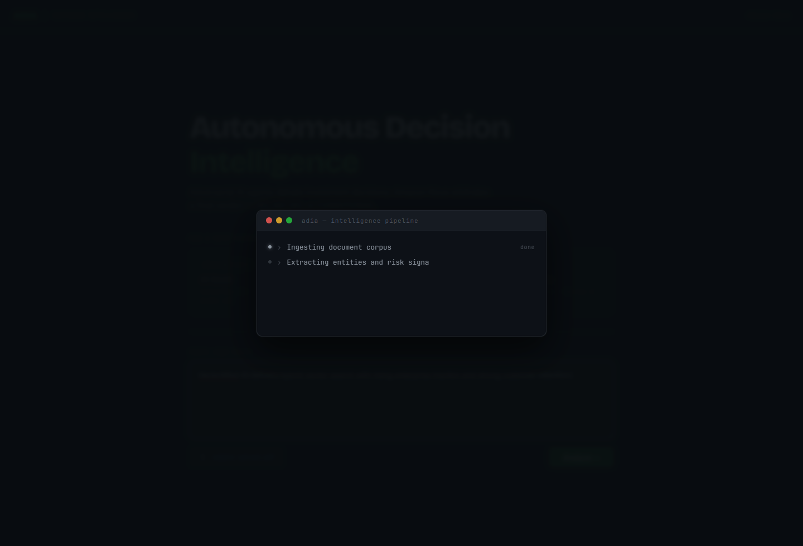
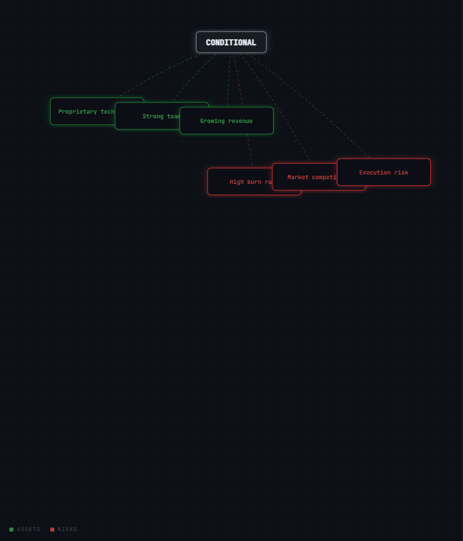
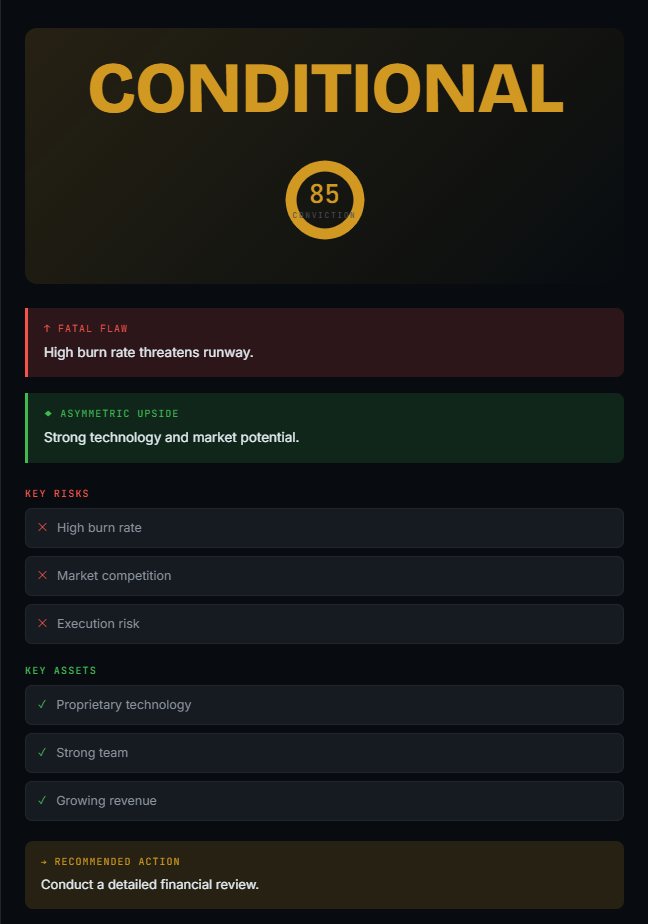
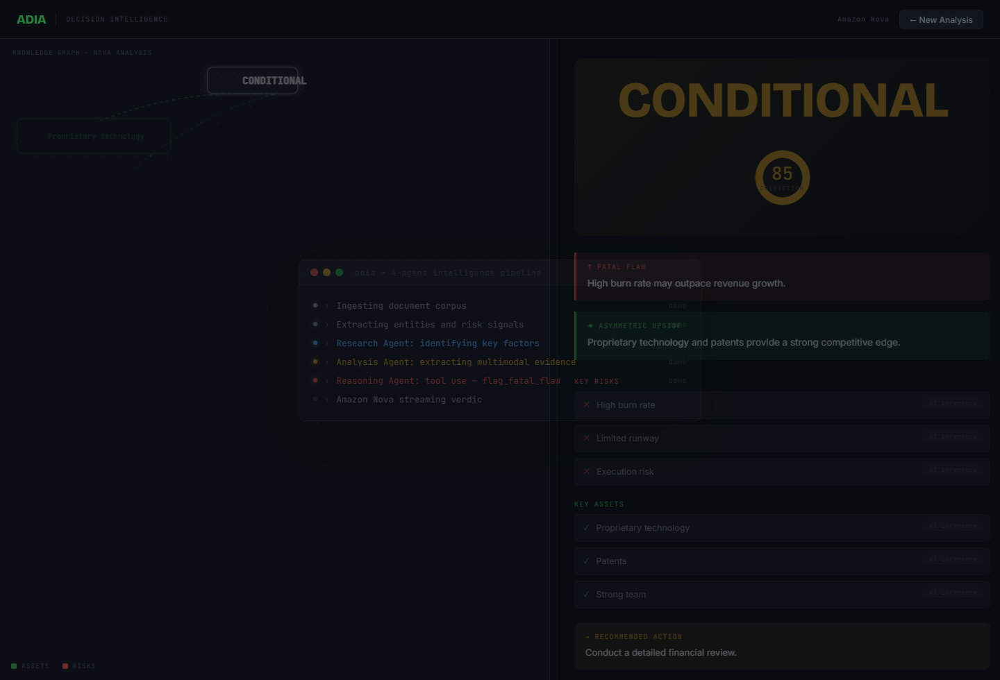

# ADIA — Autonomous Decision Intelligence Agent


> **Investor-grade pitch analysis for student founders — powered by Amazon Nova multimodal AI on AWS Bedrock.**

**[🚀 Live Demo](https://adia-nova.vercel.app)** · **[📹 Demo Video](https://youtu.be/UYmPCPeUpcg?si=nFSTw3sdVkKYTawR)** · **[📝 Blog Post](https://builder.aws.com/content/3AUn7X85k2hvfZuDQf24s4K8UOv/how-i-built-a-multimodal-ai-investment-analyst-for-student-founders-using-amazon-nova)**

---

## The Problem

Every year, thousands of student founders pitch investors and get rejected. Most never learn why.

Not because their ideas are bad. Because they had no way to stress-test their pitch before walking into that room. Professional due diligence costs thousands of dollars. Accelerator mentors are overbooked.

**ADIA gives every founder the preparation that was previously reserved for founders with the right network.**

---

## What ADIA Does

Upload a pitch deck PDF. ADIA converts each page to a PNG image and sends the **actual visual content** — charts, tables, traction graphs — to Amazon Nova Lite for analysis. Not extracted text. Real multimodal understanding.

A 4-agent pipeline runs in parallel and returns a structured verdict in under 10 seconds:

| Output | Description |
|--------|-------------|
| **Verdict** | GO / NO-GO / CONDITIONAL |
| **Conviction Score** | 0–100 with visual ring |
| **Fatal Flaw** | Flagged by Nova tool use — severity: critical / major / minor |
| **Asymmetric Upside** | What makes this a potential breakout |
| **Evidence Citations** | Every risk and asset tagged `[Page N]` or `[AI inference]` |
| **Similar Cases** | Top 2 historical pitches from FAISS semantic search with match % |
| **Next Action** | One concrete step the founder should take |

---

## Amazon Nova Integration — Every Touchpoint

This is not a wrapper. ADIA uses three distinct Amazon Nova capabilities.

### 1. Nova Lite — Multimodal Agent Reasoning
**Model:** `amazon.nova-lite-v1:0`  
**What it does:** Receives pitch text AND actual PNG images of PDF pages in the same content array. Nova reads visual evidence — charts, traction graphs, financial tables — exactly like a human investor.

```python
content = [
    {"text": "Analyze this pitch deck page for traction signals and risks."},
    {
        "image": {
            "format": "png",
            "source": {"bytes": page_image_bytes}  # actual PNG, not extracted text
        }
    }
]
```

### 2. Nova Lite — Tool Use for Structured Decisions
**Model:** `amazon.nova-lite-v1:0`  
**What it does:** Nova is given a `flag_fatal_flaw` tool. It decides when to invoke it — passing structured JSON with the flaw, severity level, and evidence. This is genuine agentic behavior — not a prompt asking for a list.

```python
tools = [{
    "toolSpec": {
        "name": "flag_fatal_flaw",
        "description": "Flag a fatal flaw that would make this a NO-GO",
        "inputSchema": {
            "json": {
                "type": "object",
                "properties": {
                    "flaw":     {"type": "string"},
                    "severity": {"type": "string", "enum": ["critical","major","minor"]},
                    "evidence": {"type": "string"}
                }
            }
        }
    }
}]
```

### 3. Nova Multimodal Embeddings — Semantic Memory
**What it does:** After generating a verdict, ADIA embeds the pitch and searches a local FAISS index of historical pitches — Airbnb 2009, Uber seed round, Stripe, WeWork, Theranos. Returns the 2 most similar cases with match % and the lesson learned.

### 4. Streaming via `converse_stream`
Every verdict streams token-by-token to the frontend via Server-Sent Events. Founders watch the reasoning appear in real time — not a loading spinner.

### 5. Agentic Loop with Session Memory
When Nova detects missing information, it invokes `request_clarification` and asks a follow-up question. The user answers. Nova re-reasons with the new context. Maximum 3 turns — full conversation history maintained per session.

---

## Architecture

```
Pitch Text + PDF Pages (PNG images)
              │
              ▼
   ┌─────────────────────────────────┐
   │        FastAPI Backend          │
   │                                 │
   │  ┌─────────────────────────┐    │
   │  │  ResearchAgent          │────┼──▶ Nova Lite Call #1
   │  │  AnalysisAgent          │    │    (parallel, multimodal images)
   │  └─────────────────────────┘    │
   │              │                  │
   │  ┌─────────────────────────┐    │
   │  │  ReasoningAgent         │────┼──▶ Nova Lite Call #2
   │  │  ReportAgent            │    │    (tool use: flag_fatal_flaw)
   │  └─────────────────────────┘    │
   └─────────────────────────────────┘
              │
              ▼
   Nova Embeddings → FAISS → Similar Cases
              │
              ▼
   SSE Streaming → Next.js Frontend
   (terminal loader + knowledge graph + verdict panel)
```

**Latency controls:**
- ResearchAgent + AnalysisAgent run in parallel via `ThreadPoolExecutor`
- 2 Nova calls total per analysis (merged from 4 logical agents)
- `maxTokens: 300`, `temperature: 0.3`
- `performanceConfig: {"latency": "optimized"}` where supported
- Keep-warm `/ping` endpoint prevents Render cold starts
- Startup warmup call on FastAPI init pre-warms Bedrock connection

**Result: under 10 seconds end-to-end.**

---

## Tech Stack

| Layer | Technology |
|-------|-----------|
| AI / Intelligence | Amazon Nova Lite via AWS Bedrock (`amazon.nova-lite-v1:0`) |
| Agent Orchestration | Custom Python orchestrator with ThreadPoolExecutor |
| Backend | FastAPI, Python 3.11, boto3, python-dotenv |
| Document Processing | pdf2image, Pillow (PNG extraction), PyPDF2 (fallback) |
| Vector Search | FAISS (local, no external API) |
| Frontend | Next.js 14 (Pages Router), React, Recharts |
| Streaming | FastAPI `StreamingResponse` + SSE + `converse_stream` |
| Deployment | Render (backend) + Vercel (frontend) |

---

## API Endpoints

| Method | Endpoint | Description |
|--------|----------|-------------|
| `GET` | `/` | Health check — returns version + Nova status |
| `GET` | `/ping` | Keep-warm endpoint — instant 200 |
| `POST` | `/demo/scenario_a` | AI SaaS GO scenario |
| `POST` | `/demo/scenario_b` | Crypto risk NO-GO scenario |
| `POST` | `/demo/scenario_c` | Hardware burn CONDITIONAL scenario |
| `POST` | `/analyze` | Analyze typed pitch text |
| `POST` | `/analyze-with-docs` | Analyze pitch + uploaded PDF/images |
| `POST` | `/analyze-stream` | Stream analysis via SSE |
| `POST` | `/analyze-start` | Start agentic loop session |
| `POST` | `/analyze-continue` | Continue agentic loop with user answer |

---

## Local Setup

### Backend

```bash
cd backend
python -m venv venv
venv\Scripts\activate        # Windows
source venv/bin/activate     # Mac/Linux
pip install -r requirements.txt
```

Create `backend/.env`:

```env
AWS_REGION=us-east-1
AWS_ACCESS_KEY_ID=your-key
AWS_SECRET_ACCESS_KEY=your-secret
AWS_SESSION_TOKEN=           # only needed for temporary STS credentials
```

Run:

```bash
uvicorn main:app --reload --port 8000
```

### Frontend

```bash
cd frontend
npm install
```

Create `frontend/.env.local`:

```env
NEXT_PUBLIC_API_URL=http://127.0.0.1:8000
```

Run:

```bash
npm run dev
```

Open `http://localhost:3000`

---

## Screenshots

| | |
|---|---|
|  |  |
|  |  |
|  |  |

---

## Community Impact

India produces more engineering graduates than any country on earth. A fraction start companies. Almost none have access to quality investor feedback before their first pitch.

ADIA is designed as infrastructure for student incubators. Any university accelerator can deploy it and evaluate hundreds of student pitches with consistent, evidence-grounded analysis. The cost per analysis on Amazon Nova Lite is fractions of a cent.

**The vision:** a platform that university programs, startup weekends, and accelerators in emerging markets white-label and run — giving every student founder the preparation previously reserved for founders with the right network.

---

## Amazon Nova Hackathon

Built for the **Amazon Nova AI Hackathon** — Multimodal Understanding + Agentic AI categories.

- **Solo student submission**
- **Category:** Multimodal Understanding
- **Models used:** Amazon Nova Lite (`amazon.nova-lite-v1:0`)
- **Nova capabilities:** Multimodal image understanding, tool use, streaming, embeddings, agentic loop

**[📝 Full technical blog post on AWS Builder Center →](https://builder.aws.com/content/3AUn7X85k2hvfZuDQf24s4K8UOv/how-i-built-a-multimodal-ai-investment-analyst-for-student-founders-using-amazon-nova)**

---

*Built with Amazon Nova on AWS Bedrock. #AmazonNova*
