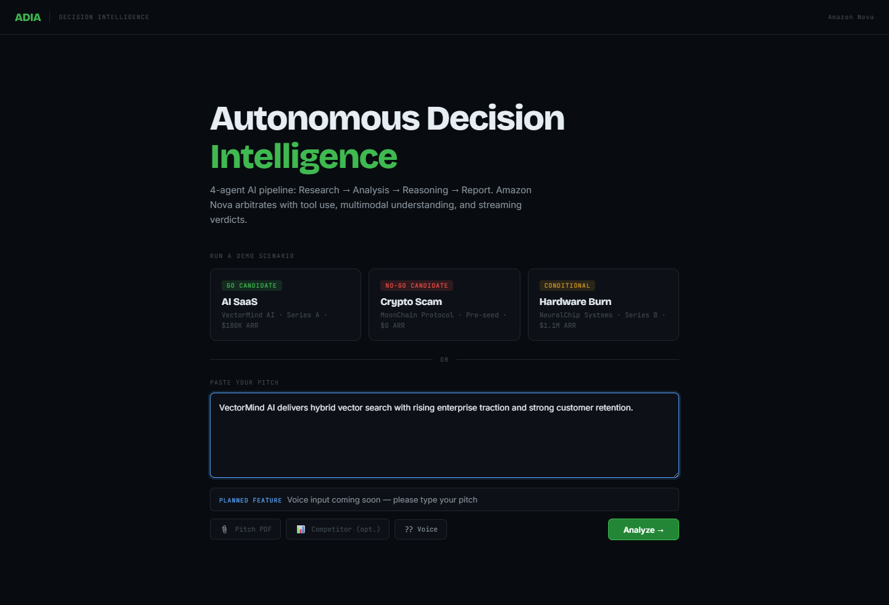

# ADIA - Autonomous Decision Intelligence Agent

    

ADIA is a decision intelligence app for hackathon demos and investor-style startup reviews. It uses Amazon Nova Lite through AWS Bedrock, a FastAPI backend, and a Next.js frontend to turn startup inputs into a structured verdict, live reasoning stream, and knowledge graph.

## Overview

Core experience:
- Research and analysis are merged into one low-latency Nova call.
- Reasoning and verdict generation are merged into one low-latency Nova call.
- PDF uploads are parsed locally, relevant context is retrieved locally, and image evidence is passed to Nova when available.
- If Bedrock is unavailable, ADIA returns a safe fallback payload so the UI never breaks.

## Architecture

```text
User Input
  |- Demo scenario
  |- Typed pitch
  |- Optional PDFs/images
  v
FastAPI Backend
  |- Local document parsing
  |- Local retrieval context
  |- Nova call 1: research + analysis
  |- Nova call 2: reasoning + verdict
  |- SSE streaming response for live UI updates
  v
Next.js Dashboard
  |- Terminal loader
  |- Verdict panel
  |- Knowledge graph
```

## Amazon Nova Integration

ADIA uses `amazon.nova-lite-v1:0` through the Bedrock Runtime client.

Current Nova flow:
1. Call 1 extracts traction, revenue signal, team strength, market size, multimodal evidence, risks, and assets.
2. Call 2 turns that analysis into a verdict with conviction score, fatal flaw, upside, and next action.

Latency controls in the backend:
- Prompts are aggressively shortened.
- `maxTokens` is capped at `300`.
- `temperature` is capped at `0.3`.
- The pipeline uses only `2` Nova calls per analysis.
- Calls are budgeted and tracked in the response metadata.

Note on latency mode:
- The backend attempts Bedrock latency optimization first.
- If `performanceConfig={"latency": "optimized"}` is not supported for the current model/region combination, ADIA retries automatically without it instead of failing the request.

## Features

- Demo scenarios for fast judge walkthroughs
- Typed pitch analysis
- Optional PDF and image-backed analysis
- Streaming analysis progress in the UI
- Structured verdict JSON with conviction score
- Knowledge graph view of assets and risks
- Safe fallback output when live Nova calls fail
- Voice button kept in the UI as a planned feature with a clean coming-soon message

## Tech Stack

- Intelligence Layer: Amazon Nova Lite via AWS Bedrock (`boto3`)
- Backend: FastAPI, Python, `python-dotenv`, `PyPDF2`, `pdf2image`, `Pillow`, `FAISS`, `numpy`
- Frontend: Next.js (Pages Router), React, Recharts
- Browser Automation: `puppeteer-core` for screenshot capture
- Deployment: Render (backend) and Vercel (frontend)

## API Endpoints

| Method | Path | Purpose |
| --- | --- | --- |
| `GET` | `/` | Health check and backend status |
| `GET` | `/ping` | Fast keep-warm endpoint |
| `POST` | `/demo/scenario_a` | AI SaaS demo scenario |
| `POST` | `/demo/scenario_b` | Crypto risk demo scenario |
| `POST` | `/demo/scenario_c` | Hardware burn demo scenario |
| `POST` | `/analyze` | Analyze a typed pitch |
| `POST` | `/analyze-with-docs` | Analyze a typed pitch with uploaded files |
| `POST` | `/analyze-stream` | Stream analysis progress and final result |

## Local Setup

### Backend

Create `backend/.env`:

```env
AWS_REGION=us-east-1
AWS_ACCESS_KEY_ID=your-key
AWS_SECRET_ACCESS_KEY=your-secret
AWS_SESSION_TOKEN=
```

Run:

```bash
cd backend
pip install -r requirements.txt
uvicorn main:app --reload --port 8000
```

### Frontend

Create `frontend/.env.local`:

```env
NEXT_PUBLIC_API_URL=http://127.0.0.1:8000
```

Run:

```bash
cd frontend
npm install
npm run dev
```

Open `http://127.0.0.1:3000`.

## Performance Notes

Latest local checks after the latency refactor:
- `/analyze`, `/analyze-with-docs`, `/demo/scenario_a`, and `/analyze-stream` all return `200`.
- Direct orchestrator timing for a typed pitch is under `5` seconds locally with `2` Nova calls.
- Startup warmup and `/ping` keep-warm logic are included in the backend.

## Screenshots





## Demo

For the judge walkthrough, see [demo/DEMO_SCRIPT.md](demo/DEMO_SCRIPT.md).

## Run Commands

```bash
cd backend
pip install -r requirements.txt
uvicorn main:app --reload

cd ../frontend
npm install
npm run dev
```
